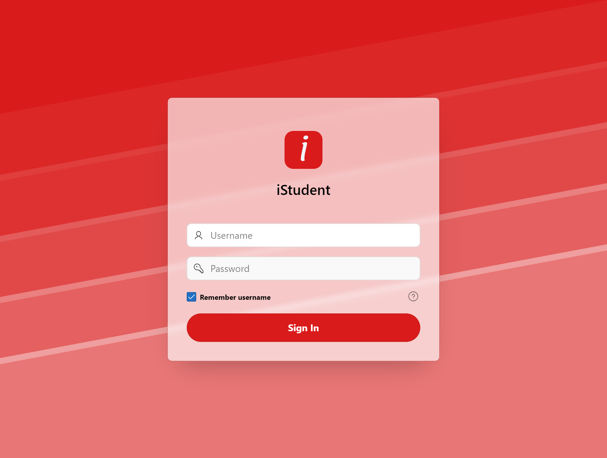
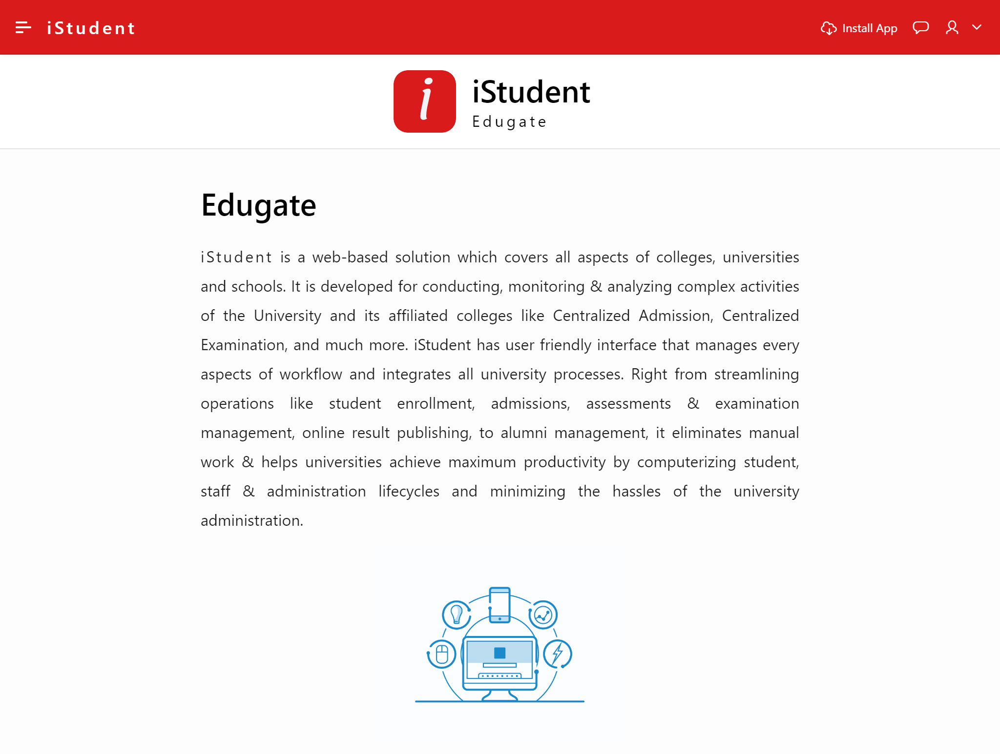
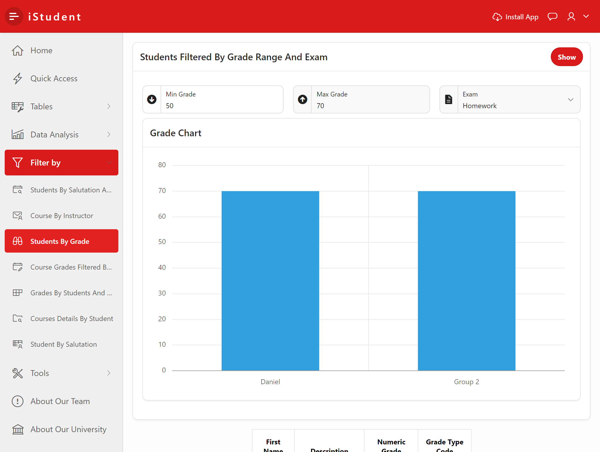
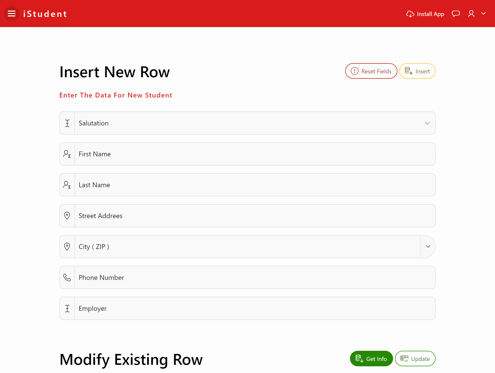

# University Portal System Apex
iStudent is a site built using [Oracle Apex](https://apex.oracle.com/en/), and it is an electronic portal for the university that enables administrators to manage faculties' data from students, teachers, and study materials, where students can be searched through tags and others, and it also enables data representation using charts.
> By: Basil Salahat, Jihad AbuZuhri, Waleed Tarboosh, Kareen Qasarweh

# Database Schema
You can see the DB [schema](Student-Database-Schema.pdf) uploded in the repo.

# Screenshots

